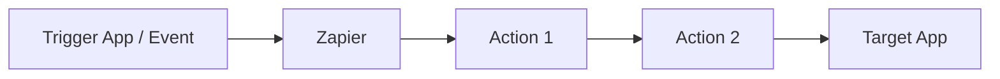
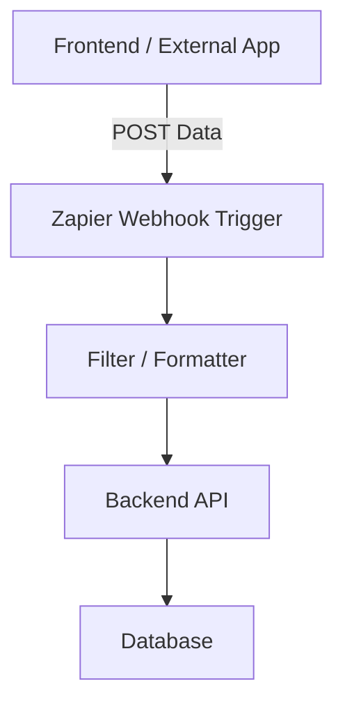
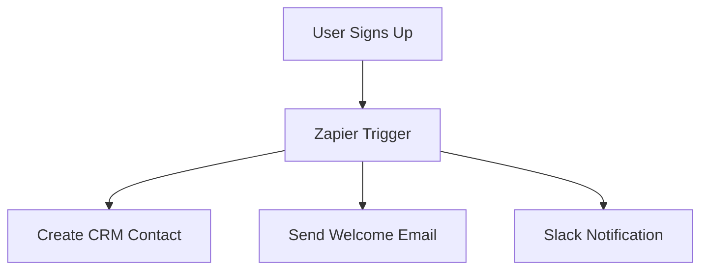
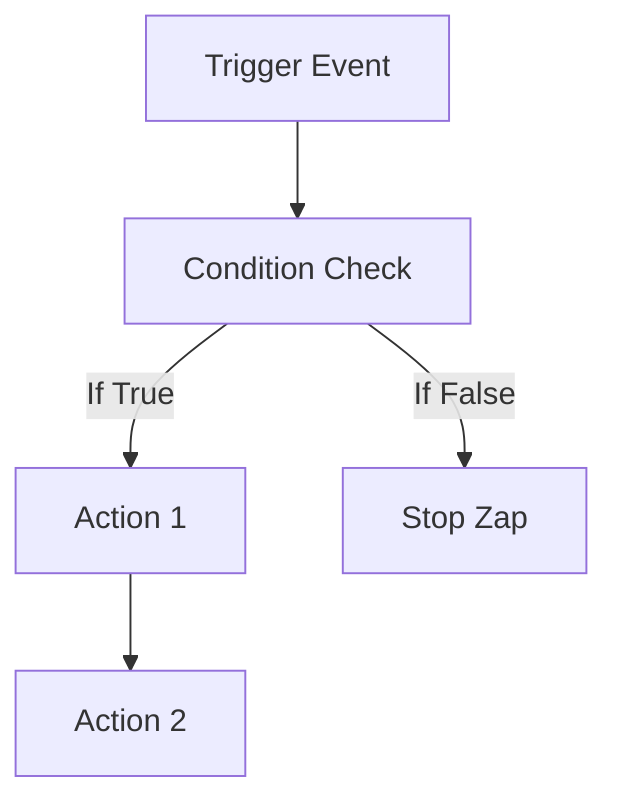

# Zapier Integration

## Overview

Zapier is an automation platform that connects different apps and services to automate workflows without writing complex code. This project demonstrates how to integrate Zapier to trigger actions, exchange data between applications, and streamline repetitive tasks.

Using Zapier, you can create **Zaps** (automated workflows) that respond to events such as form submissions, database updates, API calls, or user actions.

---

## Features

* Automate workflows between multiple applications
* Trigger actions based on events (webhooks, database updates, form submissions)
* Send and receive data using Zapier Webhooks
* Reduce manual work and improve efficiency
* Scalable and easy-to-maintain automation

---

## Tech Stack

* **Zapier** – Automation platform
* **Webhooks by Zapier** – For sending/receiving data
* **Backend (Optional)** – Node.js / Express / Next.js
* **Database (Optional)** – MongoDB / PostgreSQL / MySQL

---

## How Zapier Works

1. **Trigger** – An event that starts the workflow (e.g., new user signup)
2. **Action** – A task Zapier performs (e.g., send email, create record)
3. **Zap** – A complete automated workflow connecting trigger and actions

### Workflow Diagram (Conceptual)



---

## Workflow Examples

### 1. Webhook-Based Workflow



### 2. User Signup Automation



### 3. Multi-Step Zap Workflow



---

## Setup Instructions

### 1. Create a Zapier Account

* Go to Zapier and sign up or log in

### 2. Create a New Zap

* Click on **Create Zap**
* Choose a **Trigger App**
* Select the trigger event

### 3. Configure Webhooks (Optional)

If using Webhooks:

* Choose **Webhooks by Zapier** as trigger or action
* Select method (GET, POST, PUT, DELETE)
* Provide the endpoint URL

Example JSON payload:

```json
{
  "name": "John Doe",
  "email": "john@example.com",
  "action": "signup"
}
```

---

## Backend Example (Node.js)

```js
app.post("/zapier-webhook", (req, res) => {
  const data = req.body
  console.log(data)
  res.status(200).json({ success: true })
})
```

---

## Common Use Cases

* Send Slack notification on new user signup
* Add form submissions to Google Sheets
* Create CRM contacts automatically
* Send emails on specific events
* Sync data between multiple platforms

---

## Testing

* Use Zapier's **Test Trigger** feature
* Check webhook logs in Zapier
* Verify backend logs and responses

---

## Security Considerations

* Use secret tokens in webhook URLs
* Validate incoming requests
* Avoid exposing sensitive data
* Use HTTPS for all endpoints

---

## Limitations

* Free plan has limited Zaps and tasks
* Some apps require premium plans
* Execution delay in free tier

---

## Future Improvements

* Add authentication to webhooks
* Error handling and retries
* Advanced conditional logic
* Multi-step Zaps

